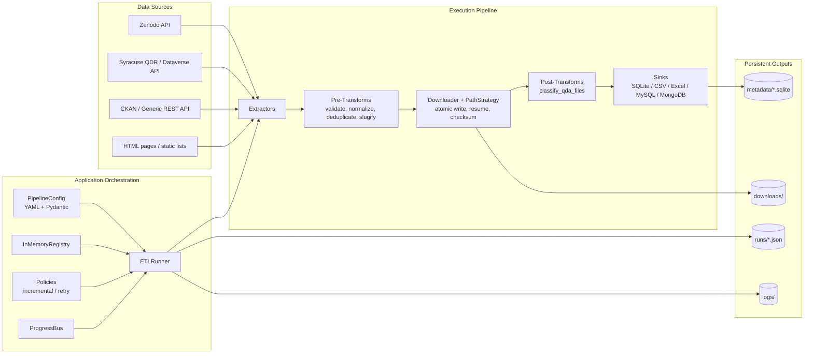

# Seeding QDArchive

A **config-driven ETL framework** for discovering, downloading, and cataloguing qualitative research datasets from open data repositories. Built to seed **QDArchive** — a platform for sharing and preserving qualitative data analysis (QDA) projects.

## What Is This Project About?

Qualitative researchers use tools like **MAXQDA**, **NVivo**, **ATLAS.ti**, and **QDA Miner** to analyze interview transcripts, documents, images, and other non-numeric data. Their work produces three categories of files:

| Category | Description | Example Extensions |
|---|---|---|
| **Analysis Data** | QDA project files containing coded annotations and the structured output of qualitative analysis | `.qdpx`, `.mx24`, `.mx22`, `.nvp`, `.nvpx`, `.atlasproj`, `.hpr7`, `.qdc` |
| **Primary Data** | The raw research inputs that were analyzed (interviews, transcripts, documents) | `.pdf`, `.docx`, `.txt`, `.rtf`, `.mp3`, `.mp4`, `.csv`, `.xlsx` |
| **Additional Data** | Supporting files (licenses, readmes, codebooks, supplementary materials) | `.zip`, `.md`, `.ods`, `.xml`, `.json` |

Researchers publish these datasets on open repositories like Zenodo, Syracuse QDR, and others. This framework **automatically discovers these datasets via repository APIs**, downloads all associated files, classifies them by type, and stores structured metadata in a database — making them available for import into QDArchive.

---

## Current Dataset Statistics

### Overview

| Metric | Value |
|---|---|
| Total datasets catalogued | **62** |
| Total assets tracked | **788** |
| Successfully downloaded | **717** (91.0%) |
| Failed downloads | **71** (9.0%) |
| Total download size | **~4.9 GB** |

### Datasets by Source

| Source | Datasets | Assets | Successful | Failed | Success Rate |
|---|---|---|---|---|---|
| Zenodo | 56 | 500 | 430 | 70 | 86.0% |
| Syracuse QDR | 5 | 286 | 285 | 1 | 99.7% |
| Uni Hannover (CKAN) | 1 | 2 | 2 | 0 | 100.0% |
| **Total** | **62** | **788** | **717** | **71** | **91.0%** |

### Asset Classification

| Type | Count | Percentage | Description |
|---|---|---|---|
| Primary Data | 608 | 77.2% | Research inputs (PDFs, transcripts, interviews) |
| Additional Data | 96 | 12.2% | Supporting files (archives, licenses, codebooks) |
| Analysis Data | 84 | 10.7% | QDA project files (the core data we seek) |

### File Extension Breakdown

#### QDA Analysis Files Found (84 total)

| Extension | Tool | Count | % of All Assets |
|---|---|---|---|
| `.nvp` | NVivo (legacy) | 24 | 3.0% |
| `.qdpx` | REFI-QDA Standard | 19 | 2.4% |
| `.nvpx` | NVivo | 9 | 1.1% |
| `.mx24` | MAXQDA 2024 | 6 | 0.8% |
| `.mx22` | MAXQDA 2022 | 5 | 0.6% |
| `.hpr7` | ATLAS.ti 7 | 3 | 0.4% |
| `.qdc` | QDA Miner | 3 | 0.4% |
| `.atlproj` | ATLAS.ti | 2 | 0.3% |

#### Top File Extensions Overall (788 total)

| Extension | Count | Percentage |
|---|---|---|
| `.pdf` | 216 | 27.4% |
| `.docx` | 201 | 25.5% |
| `.rtf` | 90 | 11.4% |
| `.txt` | 50 | 6.3% |
| `.xlsx` | 32 | 4.1% |
| `.nvp` | 24 | 3.0% |
| `.qdpx` | 19 | 2.4% |
| `.tab` | 14 | 1.8% |
| `.csv` | 12 | 1.5% |
| `.nvpx` | 9 | 1.1% |
| `.zip` | 8 | 1.0% |
| Other | 113 | 14.3% |

---

## Data Source Repository Assessment

We investigated multiple qualitative data repositories. Here is the status of each:

| Repository | URL | Status | Notes |
|---|---|---|---|
| **Zenodo** | https://zenodo.org/ | Working | REST API; Boolean search (`"MaxQDA OR NVivo OR ATLAS.ti"`); 56 datasets found |
| **Syracuse QDR** | https://qdr.syr.edu/ | Working | Dataverse API; specialized QDA repository; 5 datasets, 286 assets |
| **Uni Hannover (CKAN)** | https://data.uni-hannover.de/ | Working | CKAN API; 1 dataset with MAXQDA `.mx24` file found |
| **Dryad** | http://datadryad.org/ | Not Useful | Datasets *mention* QDA software in descriptions but contain only CSV/Excel/images — no actual QDA files |
| **DataverseNO** | https://dataverse.no/ | Not Working | API consistently times out (>90 seconds), preventing search completion |
| **DANS** | https://dans.knaw.nl/en/ | Not Working | OAI-PMH protocol provides metadata only; lacks direct file download capability |
| **UK Data Service** | https://ukdataservice.ac.uk/ | Not Working | scraping failed; no actual QDA files |
| **Qualidata Network** | https://www.qualidatanet.com/ | Not Working | no actual QDA files |
| **Qualiservice** | (part of Qualidata Network) | Not Working | no actual QDA files |
| **QualiBi** | (part of Qualidata Network) | Not Working | no actual QDA files |
| Individual uploads | Search engines | Manual | Requires manual Google/Bing searches for QDA files on generic file shares (Drive, Dropbox, etc.) |

### Dataset Search Methodology

Finding QDA project files is challenging because:

1. **Keyword mismatch**: Many datasets *mention* QDA tools (e.g., "analyzed with NVivo") in their descriptions but only contain generic data files (CSV, Excel, PDF). The actual QDA project files are not included.
2. **No standardized tagging**: Repositories don't have a dedicated "qualitative data analysis" file type category.
3. **Proprietary formats**: Each QDA tool has its own format (MAXQDA uses `.mx24`, NVivo uses `.nvp`/`.nvpx`, ATLAS.ti uses `.atlproj`/`.hpr7`), so searches must cover many extensions.

The search strategy combines:
- **Tool-name Boolean searches**: `"MaxQDA OR NVivo OR ATLAS.ti OR QDPX OR qualitative data analysis"`
- **Extension-specific searches**: Searching for specific file extensions (`.qdpx`, `.mx24`, `.nvp`, etc.)
- **Repository-specific APIs**: Each repository has different API capabilities and requires custom extractors

---

## Architecture



### Clean Architecture Layers

```
core/         Pure domain: entities, protocols, exceptions (no I/O)
  ├── entities.py        DatasetRecord, AssetRecord, RunInfo
  ├── interfaces.py      Protocols: Extractor, Transform, Sink, Downloader, ...
  ├── exceptions.py      QDArchiveError, ConfigError, RegistryError
  └── constants.py       Status codes, run modes, defaults

app/          Orchestration and configuration
  ├── config_models.py   Pydantic v2 models (PipelineConfig + sub-models)
  ├── config_loader.py   YAML → PipelineConfig, config_hash()
  ├── container.py       DI composition root
  ├── runner.py          ETLRunner (the main pipeline loop)
  ├── registry.py        InMemoryRegistry for component lookup
  ├── progress.py        Event bus for pipeline progress
  ├── policies.py        Incremental/retry skip logic
  └── manifests.py       Run manifest writer (JSON per run)

infra/        Concrete implementations
  ├── extractors/        GenericREST, Zenodo, Syracuse QDR, HTML scraper, static list
  ├── transforms/        validate, normalize, deduplicate, slugify, classify_qda_files
  ├── sinks/             SQLite, MySQL, MongoDB, CSV, Excel
  ├── storage/           Downloader (streaming, atomic, resume, checksum), PathStrategy
  ├── http/              HttpClient (retries/backoff), Auth providers, RateLimiter, Pagination
  └── logging/           Rich console, rotating file, JSON formatter, TUI queue handler

cli/          Typer CLI entry point
  └── commands/seed.py   seed run, validate-config, status, export

Import order (no circular imports):  core  ←  infra  ←  app  ←  cli
```

### Stored Metadata (What We Persist)

The pipeline persists metadata in three durable places:

1. **Dataset + asset metadata** in sink backends (default: SQLite)
2. **Run-level metadata** in run manifests (`runs/<run_id>.json`)
3. **Downloaded file metadata** on disk paths in `downloads/` (plus checksums/status in sink rows)

#### 1) Dataset metadata (`datasets` table in SQLite)

Unique key: `source_name + source_dataset_id` (idempotent upsert)

| Field | Type | Meaning |
|---|---|---|
| `id` | TEXT | Internal dataset id (`source_dataset_id` fallback to `source_url`) |
| `source_name` | TEXT | Repository name (e.g., `zenodo`, `syracuse_qdr`) |
| `source_dataset_id` | TEXT \| NULL | Repository-native dataset id |
| `source_url` | TEXT | Canonical dataset landing/API URL |
| `title` | TEXT \| NULL | Dataset title |
| `description` | TEXT \| NULL | Dataset description/abstract |
| `doi` | TEXT \| NULL | DOI if available |
| `license` | TEXT \| NULL | License label |
| `year` | INTEGER \| NULL | Publication year |
| `owner_name` | TEXT \| NULL | Owner/creator name |
| `owner_email` | TEXT \| NULL | Owner contact email |
| `created_at` | TEXT | First insert timestamp |
| `updated_at` | TEXT | Last upsert timestamp |

#### 2) Asset metadata (`assets` table in SQLite)

Unique key: `asset_url` (idempotent upsert)

| Field | Type | Meaning |
|---|---|---|
| `id` | TEXT | Internal asset id (`asset_url`) |
| `dataset_id` | TEXT | Parent dataset id |
| `asset_url` | TEXT | Source file URL |
| `asset_type` | TEXT \| NULL | Classified type (`ANALYSIS_DATA`, `PRIMARY_DATA`, `ADDITIONAL_DATA`) |
| `local_dir` | TEXT \| NULL | Local dataset directory path |
| `local_filename` | TEXT \| NULL | Saved filename |
| `downloaded_at` | TEXT \| NULL | Download completion time (ISO 8601) |
| `checksum_sha256` | TEXT \| NULL | SHA-256 checksum |
| `size_bytes` | INTEGER \| NULL | File size in bytes |
| `download_status` | TEXT \| NULL | `SUCCESS`, `FAILED`, `SKIPPED`, `RESUMABLE` |
| `error_message` | TEXT \| NULL | Failure detail when download fails |
| `updated_at` | TEXT | Last upsert timestamp |

#### 3) Run manifest metadata (`runs/*.json`)

Each pipeline run writes one manifest file with:

| Field | Meaning |
|---|---|
| `run_id` | UUID for the run |
| `pipeline_id` | Pipeline identifier from config |
| `started_at`, `ended_at` | Run timing (ISO 8601) |
| `config_hash` | Hash of the effective config used |
| `counts` | Processed datasets/assets counters |
| `failures` | Structured error records |
| `environment` | Runtime environment snapshot |

### Project Structure

```
qdarchive-seeding/
├── pyproject.toml              Project config (uv, ruff, mypy, pytest)
├── CLAUDE.md                   AI assistant instructions
├── README.md                   This file
├── configs/
│   ├── examples/
│   │   ├── zenodo.yaml         Example Zenodo pipeline config
│   │   ├── syracuse_qdr.yaml   Example Syracuse QDR config
│   │   └── auth_api.yaml       Example authenticated API config
│   ├── my_zenodo.yaml          Production Zenodo config
│   ├── syracuse_qdr.yaml       Production Syracuse QDR config
│   ├── hannover_transens.yaml  Uni Hannover CKAN config
│   └── logging.yaml            Logging configuration
├── src/qdarchive_seeding/      Source code (see Architecture above)
├── tests/
│   ├── unit/                   17 test modules
│   └── integration/            Pipeline integration tests
├── metadata/                   SQLite databases
├── downloads/                  Downloaded dataset files
├── logs/                       Pipeline run logs
└── runs/                       Run manifest JSONs
```

---

## Getting Started

### Prerequisites

- **Python 3.11+**
- **[uv](https://docs.astral.sh/uv/)** package manager

### Installation

```bash
# Clone the repository
git clone <repository-url>
cd qdarchive-seeding

# Install all dependencies (runtime + dev)
uv sync --dev
```

### Configuration

Everything is driven by YAML config files. Secrets are **never stored in YAML** — only environment variable names are referenced.

```yaml
# configs/examples/zenodo.yaml (simplified)
pipeline:
  id: "zenodo_seed_v1"
  run_mode: "incremental"
  max_items: 500

source:
  name: "zenodo"
  type: "rest_api"
  base_url: "https://zenodo.org/api"
  endpoints:
    search: "/records"
  params:
    q: "MaxQDA OR NVivo OR ATLAS.ti OR QDPX"
    size: 50

extractor:
  name: "zenodo_extractor"
  options:
    include_files: true

pre_transforms:
  - name: "validate_required_fields"
    options:
      required_fields: ["source_url", "has_assets"]
  - name: "normalize_fields"
  - name: "deduplicate_assets"
  - name: "slugify_dataset"

post_transforms:
  - name: "classify_qda_files"

storage:
  downloads_root: "./downloads"
  layout: "{source_name}/{dataset_slug}/"
  checksum: "sha256"

sink:
  type: "sqlite"
  options:
    path: "./metadata/qdarchive.sqlite"
```

### Running a Pipeline

```bash
# Dry run (no downloads, just extract + transform)
uv run python -m qdarchive_seeding.cli seed run \
  --config configs/examples/zenodo.yaml --dry-run

# Full run with download limit
uv run python -m qdarchive_seeding.cli seed run \
  --config configs/examples/zenodo.yaml --max-items 10

# Production Zenodo run
uv run python -m qdarchive_seeding.cli seed run \
  --config configs/my_zenodo.yaml

# Syracuse QDR run
uv run python -m qdarchive_seeding.cli seed run \
  --config configs/syracuse_qdr.yaml

# Validate a config file
uv run python -m qdarchive_seeding.cli seed validate-config \
  --config configs/examples/zenodo.yaml

# Check database status
uv run python -m qdarchive_seeding.cli seed status

# Export to CSV or Excel
uv run python -m qdarchive_seeding.cli seed export --format csv --out export.csv
```

---

## Development

### Commands

```bash
# Install dependencies
uv sync --dev

# Run all tests
uv run pytest

# Run a single test file
uv run pytest tests/unit/test_transforms.py

# Lint
uv run ruff check .

# Format check / auto-fix
uv run ruff format --check .
uv run ruff format .

# Type checking
uv run mypy src

# Tests with coverage
uv run pytest --cov=qdarchive_seeding
```

### Code Conventions

- `from __future__ import annotations` at the top of every module
- `@dataclass(slots=True)` for all dataclasses
- Strict typing; mypy runs in strict mode
- Ruff: line-length 100, rules `E, F, I, B, UP, C4, SIM`
- Python 3.11+
- Secrets read from `os.environ` only — never hardcoded

### Adding a New Data Source

1. **Create an extractor** in `src/qdarchive_seeding/infra/extractors/` implementing the `Extractor` protocol
2. **Register it** in `app/container.py` under `_build_extractor()`
3. **Create a YAML config** in `configs/` referencing the new extractor by name
4. Run the pipeline — no core code changes needed

### Test Suite

17 unit test modules + 2 integration tests covering:

| Module | What It Tests |
|---|---|
| `test_config_loader.py` | YAML parsing, validation, config hash stability |
| `test_registry.py` | Component registration and lookup |
| `test_auth.py` | NoAuth, ApiKey, Bearer authentication |
| `test_pagination.py` | Page/offset/cursor pagination |
| `test_transforms.py` | All transforms including QDA file classification |
| `test_sinks_sqlite.py` | SQLite upsert idempotency |
| `test_sinks_csv.py` | CSV header creation and append semantics |
| `test_runner.py` | Full pipeline with fake components, dry-run, cancellation |
| `test_cli.py` | CLI commands via Typer CliRunner |
| `test_logging.py` | Logger configuration, queue handler, context filter |
| `test_progress.py` | Publish/subscribe, exception isolation |
| `test_policies.py` | Incremental/retry skip logic |
| `test_manifests.py` | Write/load roundtrip, run listing |
| `test_container.py` | DI container building |
| `test_paths.py` | Path strategy, safe filename generation |
| `test_pipeline_sqlite.py` | End-to-end: static list → transforms → SQLite |
| `test_pipeline_csv.py` | End-to-end: static list → transforms → CSV |

---

## Known QDA File Extensions

The following file extensions are recognized as QDA analysis data by the `classify_qda_files` transform:

| Tool | Extensions |
|---|---|
| **REFI-QDA Standard** | `.qdpx` |
| **MAXQDA** | `.mx24`, `.mx22`, `.mx20`, `.mx18`, `.mx12`, `.mx11`, `.mx5`, `.mx4`, `.mx3`, `.mx2`, `.m2k`, `.mqbac`, `.mqtc`, `.mqex`, `.mqmtr`, `.mex24`, `.mc24`, `.mex22` |
| **NVivo** | `.nvp`, `.nvpx` |
| **ATLAS.ti** | `.atlasproj`, `.atlproj`, `.hpr7` |
| **QDA Miner / Provalis** | `.qdc`, `.qpd` |
| **f4analyse** | `.f4p` |
| **Quirkos** | `.qlt` |
| **Transana** | `.loa`, `.sea`, `.mtr`, `.mod` |
| **Dedoose** | `.ppj`, `.pprj` |
| **MQDA** | `.mqda` |

---

## Implementation Status

| Milestone | Status | Description |
|---|---|---|
| M0 | Done | Bootstrap: repo skeleton, CI, configs |
| M1 | Done | Core domain + config models (entities, interfaces, Pydantic) |
| M2 | Done | Logging module (Rich console, rotating file, UILogQueueHandler) |
| M3 | Done | HTTP infrastructure (retries, auth, rate limiting, pagination) |
| M4 | Done | Extractors (GenericREST, Zenodo, HTML scraper, static list, Syracuse QDR) |
| M5 | Done | Transform pipeline (chain-of-responsibility, built-in transforms) |
| M6 | Done | Storage + downloader (atomic writes, resume, checksums) |
| M7 | Done | Sinks (SQLite, MySQL, MongoDB, CSV, Excel) |
| M8 | Done | App orchestration: runner, container, progress, policies, manifests |
| M9 | Done | CLI (Typer: `seed run`, `validate-config`, `status`, `export`) |
| M10 | Pending | Complete stub implementations (MySQL, MongoDB, OAuth2) |
| M11 | Pending | TUI v1 — core screens: Home, RunSelect, RunMonitor, live log viewer |
| M12 | Pending | TUI v2 — Config Wizard (8 steps), Config Editor, Config Validate |
| M13 | Pending | TUI v3 — Run History, Browse Downloads, Settings, reactive state |

---

## Issues and Challenges

### Download Failures

- **Zenodo rate limiting**: Some Zenodo datasets with many files (e.g., "Mapping 'the constructive turn'" with 81 files) experienced 60 failures due to rate limiting or intermittent server errors.
- **Access-restricted files**: A small number of Zenodo records advertise files in metadata but return 403/404 when downloading.
- **Syracuse QDR API file URLs**: QDR serves files via `/api/access/datafile/{id}` — filenames must be extracted from HTTP `Content-Disposition` headers rather than the URL.

### Search Quality

The biggest challenge is **precision vs. recall**: broad keyword searches return many datasets that merely *mention* qualitative research tools without actually containing QDA project files. The `classify_qda_files` post-transform helps by categorizing downloaded files, but filtering at the search level remains difficult without repository support for file-type filtering.

---

## Dependencies

### Runtime
`pydantic>=2.6` | `pyyaml>=6` | `httpx>=0.27` | `tenacity>=8.2` | `rich>=13.7` | `textual>=0.63` | `typer[all]>=0.12` | `beautifulsoup4>=4.12` | `pandas>=2.2` | `openpyxl>=3.1` | `pymysql>=1.1` | `pymongo>=4.7`

### Development
`pytest>=8.1` | `pytest-cov>=5.0` | `ruff>=0.5` | `mypy>=1.10` | `respx>=0.21` | `pytest-asyncio>=0.23`

---

## License

MIT
