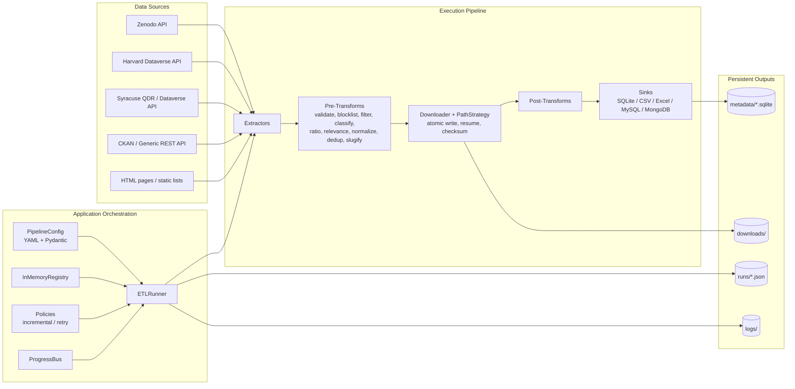

# Seeding QDArchive

A **config-driven ETL framework** for discovering, downloading, and cataloguing qualitative research datasets from open data repositories. Built to seed **QDArchive** --- a platform for sharing and preserving qualitative data analysis (QDA) projects.

## What Is This Project About?

Qualitative researchers use tools like **MAXQDA**, **NVivo**, **ATLAS.ti**, and **QDA Miner** to analyze interview transcripts, documents, images, and other non-numeric data. Their work produces three categories of files:

| Category | Description | Example Extensions |
|---|---|---|
| **Analysis Data** | QDA project files containing coded annotations and the structured output of qualitative analysis | `.qdpx`, `.mx24`, `.mx22`, `.nvp`, `.nvpx`, `.atlasproj`, `.hpr7`, `.qdc` |
| **Primary Data** | The raw research inputs that were analyzed (interviews, transcripts, documents) | `.pdf`, `.docx`, `.txt`, `.rtf`, `.mp3`, `.mp4`, `.csv`, `.xlsx` |
| **Additional Data** | Supporting files (licenses, readmes, codebooks, supplementary materials) | `.zip`, `.md`, `.ods`, `.xml`, `.json` |

Researchers publish these datasets on open repositories like Zenodo, Syracuse QDR, and others. This framework **automatically discovers these datasets via repository APIs**, downloads all associated files, classifies them by type, and stores structured metadata in a database --- making them available for import into QDArchive.

---

## Supported Data Sources

### Data Source Repository

We investigated multiple qualitative data repositories. Here is the status of each:

| Repository | URL | Status | Notes |
|---|---|---|---|
| **Zenodo** | https://zenodo.org/ | Working | REST API; multi-query with auto date-splitting for large result sets; extension + NL queries |
| **Harvard Dataverse** | https://dataverse.harvard.edu/ | Working | Dataverse API; 146 queries (extension + NL); per-dataset file fetching |
| **Syracuse QDR** | https://qdr.syr.edu/ | Working | Dataverse API; specialized QDA repository; extension + NL queries |
| **Uni Hannover (CKAN)** | https://data.uni-hannover.de/ | Working | CKAN API; 1 dataset with MAXQDA `.mx24` file found |


*Note: Exact counts change as pipelines run incrementally. Use `qdarchive seed status` to see current counts.*

### Per-Repository Download Statistics

#### Zenodo (254,852 datasets | 3,023,706 files)

| Status | Datasets | Files | Downloaded | Size (approx.) |
|---|---|---|---|---|
| Fully downloaded | 3,950 | 935,898 | 935,898 | 443.2 GB |
| Downloaded (rest access-denied) | 78 | 1,215 | 1,023 | 2.4 GB |
| Partially downloaded | 1,271 | 114,093 | 110,705 | 143.0 GB |
| All access-denied | 5 | 5 | 0 | 2.1 GB |
| All skipped | 2 | 2 | 0 | < 0.1 GB |
| Download not attempted | 249,546 | 1,972,493 | 0 | 513,078.0 GB |

- **Total datasets**: 254,852
- **Fully downloaded**: 3,950
- **Files downloaded**: 1,047,626
- **Download not attempted**: 249,546

#### Harvard Dataverse (14,653 datasets | 294,228 files)

| Status | Datasets | Files | Downloaded | Size (approx.) |
|---|---|---|---|---|
| No file records in DB | 1,192 | 0 | 0 | - |
| Fully downloaded | 3,068 | 119,678 | 119,678 | 391.2 GB |
| Downloaded (rest access-denied) | 5 | 2,874 | 40 | 0.4 GB |
| Partially downloaded | 301 | 13,102 | 9,151 | 32.1 GB |
| All access-denied | 27 | 27 | 0 | < 0.1 GB |
| All skipped | 2,981 | 21,905 | 0 | 283.2 GB |
| Download not attempted | 6,828 | 129,362 | 0 | 17,177.2 GB |
| Other | 251 | 7,280 | 3,911 | 28.7 GB |

- **Total datasets**: 14,653
- **Fully downloaded**: 3,068
- **Files downloaded**: 132,780
- **No file records**: 1,192 (harvested datasets where origin server returned no file listing)
- **Download not attempted**: 6,828

---

### Dataset Search Methodology

Finding QDA project files is challenging because:

1. **Keyword mismatch**: Many datasets *mention* QDA tools (e.g., "analyzed with NVivo") in their descriptions but only contain generic data files (CSV, Excel, PDF). The actual QDA project files are not included.
2. **No standardized tagging**: Repositories don't have a dedicated "qualitative data analysis" file type category.
3. **Proprietary formats**: Each QDA tool has its own format (MAXQDA uses `.mx24`, NVivo uses `.nvp`/`.nvpx`, ATLAS.ti uses `.atlproj`/`.hpr7`), so searches must cover many extensions.

The search strategy combines:
- **Tool-name Boolean searches**: `"MaxQDA OR NVivo OR ATLAS.ti OR QDPX OR qualitative data analysis"`
- **Extension-specific searches**: Searching for specific file extensions (`.qdpx`, `.mx24`, `.nvp`, etc.)
- **Repository-specific APIs**: Each repository has different API capabilities and requires custom extractors

---

## Architecture



### Clean Architecture Layers

```
core/         Pure domain: entities, protocols, exceptions, progress events (no I/O)
  ├── entities.py        DatasetRecord, AssetRecord, RunInfo, PersonRole
  ├── interfaces.py      Protocols: Extractor, Transform, Sink, Downloader, LoggingConfig, ...
  ├── exceptions.py      QDArchiveError, ConfigError, RegistryError
  ├── constants.py       Status codes, run modes, defaults
  └── progress.py        Progress event dataclasses + ProgressBus

app/          Orchestration and configuration
  ├── config_models.py     Pydantic v2 models (PipelineConfig + sub-models)
  ├── config_loader.py     YAML -> PipelineConfig, config_hash()
  ├── container.py         DI composition root (17 components)
  ├── runner.py            ETLRunner: metadata phase + download phase coordination
  ├── download_strategy.py DownloadDecision, DownloadCounters, ICPSR cookie helpers
  ├── asset_processing.py  Per-asset download execution, ICPSR dispatch, error classification
  ├── registry.py          InMemoryRegistry for component lookup
  ├── progress.py          Re-exports from core.progress (backward compat)
  ├── policies.py          Incremental/retry skip logic
  ├── checkpoint.py        Checkpoint/resume state manager
  └── manifests.py         Run manifest writer (JSON per run)

infra/        Concrete implementations
  ├── extractors/        Zenodo, Harvard Dataverse, Syracuse QDR, GenericREST, HTML scraper,
  │   │                  static list + shared _checkpoint.py helpers
  │   └── _checkpoint.py Shared checkpoint lifecycle (is_query_done, get_resume_page, mark_query_done)
  ├── transforms/        validate, normalize, deduplicate, slugify, infer_filetypes,
  │                      classify_qda_files, filter_by_extensions, blocklist_extensions,
  │                      extension_ratio_filter, metadata_relevance_filter, _text_utils
  ├── sinks/             SQLite, CSV, Excel, MySQL, MongoDB
  │   └── _buffered.py   BufferedSink base class (shared by CSV + Excel)
  ├── storage/           Downloader (streaming, atomic, resume, checksum), PathStrategy,
  │                      ZIP extractor, ICPSR downloader
  ├── http/              HttpClient (retries/backoff), Auth providers, RateLimiter, Pagination
  └── logging/           Rich console, rotating file, JSON formatter, TUI queue handler

cli/          Typer CLI entry point
  ├── main.py            App entry point (qdarchive command)
  ├── commands/seed.py   seed run, validate-config, status, export
  ├── display.py         Rich progress display (live panel with progress bars)
  └── prompts.py         Interactive download confirmation prompts

Import order (no circular imports):  core  <-  infra  <-  app  <-  cli
```

### Registered Components

Components are registered by name in `InMemoryRegistry` and referenced in YAML config:

| Type | Available Names |
|---|---|
| **Extractors** | `zenodo_extractor`, `harvard_dataverse_extractor`, `syracuse_qdr_extractor`, `generic_rest_extractor`, `html_scraper_extractor`, `static_list_extractor` |
| **Pre-Transforms** | `validate_required_fields`, `normalize_fields`, `infer_filetypes`, `deduplicate_assets`, `slugify_dataset`, `filter_by_extensions`, `blocklist_extensions`, `classify_qda_files`, `extension_ratio_filter`, `metadata_relevance_filter` |
| **Post-Transforms** | *(empty — classify_qda_files moved to pre-transforms)* |
| **Sinks** | `sqlite`, `csv`, `excel`, `mysql`, `mongodb` |
| **Auth Providers** | `none`, `api_key`, `bearer`, `oauth2` |
| **Policies** | `incremental`, `retry` |

### Stored Metadata (What We Persist)

The pipeline persists metadata in three durable places:

1. **Dataset + asset metadata** in sink backends (default: SQLite)
2. **Run-level metadata** in run manifests (`runs/<run_id>.json`)
3. **Downloaded file metadata** on disk paths in `downloads/` (plus checksums/status in sink rows)

#### 1) Project metadata (`projects` table in SQLite)

Unique key: `(repository_id, download_project_folder, version)` (idempotent upsert)

| Field | Type | Meaning |
|---|---|---|
| `id` | INTEGER | Auto-increment primary key |
| `query_string` | TEXT | Search query that found this dataset |
| `repository_id` | INTEGER | Source repository identifier (1=Zenodo, 10=Harvard, 20=QDR) |
| `repository_url` | TEXT | Source repository URL |
| `project_url` | TEXT | Dataset landing page URL |
| `version` | TEXT | Dataset version |
| `title` | TEXT | Dataset title |
| `description` | TEXT | Dataset description/abstract |
| `language` | TEXT | Dataset language |
| `doi` | TEXT | DOI if available |
| `upload_date` | TEXT | Publication date |
| `download_date` | TEXT | Download timestamp |
| `download_repository_folder` | TEXT | Source name for local storage |
| `download_project_folder` | TEXT | Dataset identifier for local storage |
| `download_version_folder` | TEXT | Version folder for local storage |
| `download_method` | TEXT | `SCRAPING` or `API-CALL` |
| `is_harvested` | INTEGER | Whether dataset was harvested from another repository |
| `harvested_from` | TEXT | Original repository host if harvested |

Related tables: `keywords` (project_id, keyword), `person_role` (project_id, name, role), `licenses` (project_id, license)

#### 2) File metadata (`files` table in SQLite)

Unique key: `(project_id, file_name)` (idempotent upsert)

| Field | Type | Meaning |
|---|---|---|
| `id` | INTEGER | Auto-increment primary key |
| `project_id` | INTEGER | Parent project id (FK) |
| `file_name` | TEXT | Filename |
| `file_type` | TEXT | File extension |
| `asset_url` | TEXT | Source download URL |
| `size_bytes` | INTEGER | File size in bytes |
| `status` | TEXT | `UNKNOWN`, `SUCCESS`, `FAILED`, `SKIPPED`, `RESUMABLE` |
| `error_message` | TEXT | Error details if status is `FAILED` |

#### 3) Run manifest metadata (`runs/*.json`)

Each pipeline run writes one manifest file with:

| Field | Meaning |
|---|---|
| `run_id` | UUID for the run |
| `pipeline_id` | Pipeline identifier from config |
| `started_at`, `ended_at` | Run timing (ISO 8601) |
| `config_hash` | Hash of the effective config used |
| `counts` | Processed datasets/assets counters |
| `failures` | Structured error records |
| `environment` | Runtime environment snapshot |

### Project Structure

```
qdarchive-seeding/
├── pyproject.toml              Project config (uv, ruff, mypy, pytest)
├── README.md                   This file
├── configs/
│   ├── examples/
│   │   ├── zenodo.yaml              Example Zenodo pipeline config
│   │   ├── harvard_dataverse.yaml   Example Harvard Dataverse config
│   │   ├── syracuse_qdr.yaml        Example Syracuse QDR config
│   │   └── auth_api.yaml            Example authenticated API config
│   ├── my_zenodo.yaml               Production Zenodo config
│   ├── harvard_dataverse.yaml       Production Harvard Dataverse config
│   ├── syracuse_qdr.yaml            Production Syracuse QDR config
│   ├── hannover_transens.yaml       Uni Hannover CKAN config
│   ├── reference_descriptions.yaml  Curated QDA reference descriptions for embedding centroid
│   └── logging.yaml                 Logging configuration
├── src/qdarchive_seeding/      Source code (see Architecture above)
├── tests/
│   ├── unit/                   30 test modules organized by layer
│   │   ├── core/               Progress bus tests
│   │   ├── app/                Runner, config, registry, checkpoint, policies, manifests
│   │   ├── infra/
│   │   │   ├── extractors/     Extractor tests (Zenodo, Harvard, Syracuse, generic)
│   │   │   ├── sinks/          Sink tests (SQLite, CSV, Excel, MySQL/MongoDB)
│   │   │   ├── http/           HTTP client, auth, pagination, rate limiting
│   │   │   ├── transforms/     Transform chain and built-in transforms
│   │   │   ├── storage/        Downloader, paths, checksums, filesystem, ZIP safety
│   │   │   └── logging/        Logger configuration and handlers
│   │   └── cli/                CLI command tests
│   └── integration/            End-to-end pipeline tests (SQLite + CSV)
├── metadata/                   SQLite databases
├── downloads/                  Downloaded dataset files
├── logs/                       Pipeline run logs
└── runs/                       Run manifest JSONs
```

---

## Getting Started

### Prerequisites

- **Python 3.11+**
- **[uv](https://docs.astral.sh/uv/)** package manager

### Installation

```bash
# Clone the repository
git clone <repository-url>
cd qdarchive-seeding

# Install all dependencies (runtime + dev)
uv sync --dev
```

### Configuration

Everything is driven by YAML config files. Secrets are **never stored in YAML** --- only environment variable names are referenced.

```yaml
# configs/examples/zenodo.yaml (simplified)
pipeline:
  id: "zenodo_seed_v2"
  run_mode: "incremental"        # "incremental" or "full"
  max_items: null                 # null = no limit; set integer to cap
  phases: ["metadata", "download"]

source:
  name: "zenodo"
  type: "rest_api"               # "rest_api", "html", or "static_list"
  base_url: "https://zenodo.org/api"
  repository_id: 1
  repository_url: "https://zenodo.org"
  endpoints:
    search: "/records"
  params:
    size: 100
  pagination:
    type: "page"                 # "page", "offset", or "cursor"
    page_param: "page"
    size_param: "size"
  search_strategy:
    base_query_prefix: "resource_type.type:dataset AND"
    facet_filters: {}            # Extra API params applied to all queries
    extension_queries:
      - "qdpx"
      - "nvp"
      - "mx24"
      # ... more QDA file extensions
    natural_language_queries:
      - "interview study"
      - "qualitative research dataset"
      # ... more NL queries

auth:
  type: "bearer"                 # "none", "api_key", "bearer", or "oauth2"
  env:
    token: "ZENODO_TOKEN"        # Environment variable name (not the secret!)
  placement: "header"            # "header" or "query" (for api_key type)
  header_name: null              # Custom header name (for api_key type)

# Optional: auth for external repositories (e.g., harvested datasets)
external_auth:
  borealisdata.ca:
    type: "api_key"
    env:
      api_key: "BOREALIS_TOKEN"
    header_name: "X-Dataverse-key"
  www.openicpsr.org:
    type: "browser_session"
    browser: "chromium"          # "chromium" or "chrome"

extractor:
  name: "zenodo_extractor"       # See "Registered Components" table
  options:
    include_files: true
    auto_date_split: true        # Split large queries by date range (Zenodo)
    ext_batch_size: 10           # Extension queries per API request (Zenodo)
    nl_batch_size: 4             # NL queries per API request (Zenodo)
    per_page: 10                 # Results per page (Harvard Dataverse)
    max_pages: null              # null = use safety max

pre_transforms:
  - name: "validate_required_fields"
    options:
      required_fields: ["source_url"]
  - name: "normalize_fields"
  - name: "deduplicate_assets"
  - name: "slugify_dataset"

post_transforms:
  - name: "classify_qda_files"

storage:
  downloads_root: "./downloads"
  layout: "{source_name}/{dataset_slug}/{version}/"
  checksum: "sha256"             # "sha256" or "none"
  chunk_size_bytes: null         # Custom chunk size for streaming downloads
  max_dataset_size_gb: null      # Skip datasets larger than this

sink:
  type: "sqlite"                 # "sqlite", "csv", "excel", "mysql", "mongodb"
  options:
    path: "./metadata/qdarchive.sqlite"
    # CSV/Excel options:
    #   dataset_path: "./metadata/datasets.csv"
    #   asset_path: "./metadata/assets.csv"
    #   path: "./metadata/qdarchive.xlsx"     (Excel)
    # MySQL options:
    #   host: "localhost"
    #   port: 3306
    #   database: "qdarchive"
    #   user_env: "MYSQL_USER"
    #   password_env: "MYSQL_PASSWORD"
    # MongoDB options:
    #   uri_env: "MONGO_URI"
    #   database: "qdarchive"

http:
  timeout_seconds: 15
  max_retries: 5
  backoff_min: 0.5
  backoff_max: 6.0
  rate_limit_per_second: 0.5

logging:
  level: "INFO"                  # DEBUG, INFO, WARNING, ERROR
  console:
    enabled: true
    rich: true                   # Use Rich formatted console output
  file:
    enabled: false
    path: "./logs/pipeline.log"
```

---

## Running a Pipeline

The CLI is available as `qdarchive` (installed entry point) or via `uv run qdarchive`:

### Basic Usage

```bash
# Run a full pipeline (metadata collection + downloads)
qdarchive seed run --config configs/my_zenodo.yaml

# Dry run --- extract and transform only, no downloads
qdarchive seed run --config configs/examples/zenodo.yaml --dry-run

# Metadata only --- collect metadata, skip download phase entirely
qdarchive seed run --config configs/my_zenodo.yaml --metadata-only

# Limit the number of datasets processed
qdarchive seed run --config configs/examples/zenodo.yaml --max-items 10

# Skip the interactive download confirmation prompt
qdarchive seed run --config configs/my_zenodo.yaml --no-confirm
```

### Resume and Retry

```bash
# Normal incremental run --- automatically resumes from checkpoint,
# skips already-downloaded files and completed queries
qdarchive seed run --config configs/my_zenodo.yaml

# Re-extract everything from scratch (clears checkpoint state)
qdarchive seed run --config configs/my_zenodo.yaml --fresh-extract

# Re-download all files (ignores prior SUCCESS status in DB)
qdarchive seed run --config configs/my_zenodo.yaml --fresh-download

# Retry only previously failed downloads
qdarchive seed run --config configs/my_zenodo.yaml --retry-failed
```

### Production Runs (Each Source)

```bash
qdarchive seed run --config configs/my_zenodo.yaml
qdarchive seed run --config configs/harvard_dataverse.yaml
qdarchive seed run --config configs/syracuse_qdr.yaml
qdarchive seed run --config configs/hannover_transens.yaml
```

### Other Commands

```bash
# Validate a config file without running the pipeline
qdarchive seed validate-config --config configs/examples/zenodo.yaml

# Check database status (project and file counts)
qdarchive seed status
qdarchive seed status --db ./metadata/custom.sqlite

# Export projects and files to CSV or Excel
qdarchive seed export --format csv --out ./export
qdarchive seed export --format excel --out ./export/data.xlsx
qdarchive seed export --format csv --out ./export --db ./metadata/custom.sqlite
```

### CLI Flags Reference

#### `seed run`

| Flag | Type | Default | Description |
|---|---|---|---|
| `--config` | PATH | *(required)* | Path to YAML config file |
| `--dry-run` | flag | `false` | Extract and transform only, no downloads |
| `--metadata-only` | flag | `false` | Collect metadata only, skip download phase |
| `--fresh-extract` | flag | `false` | Clear checkpoint, re-extract all queries from scratch |
| `--fresh-download` | flag | `false` | Re-download all files, ignoring prior SUCCESS status |
| `--retry-failed` | flag | `false` | Retry only previously failed downloads |
| `--max-items` | INT | `null` | Override max items from config |
| `--no-confirm` | flag | `false` | Skip the interactive download confirmation prompt |

#### `seed validate-config`

| Flag | Type | Default | Description |
|---|---|---|---|
| `--config` | PATH | *(required)* | Path to YAML config file to validate |

#### `seed status`

| Flag | Type | Default | Description |
|---|---|---|---|
| `--db` | PATH | `./metadata/qdarchive.sqlite` | Path to SQLite database |

#### `seed export`

| Flag | Type | Default | Description |
|---|---|---|---|
| `--format` | TEXT | `csv` | Export format: `csv` or `excel` |
| `--out` | PATH | `./export` | Output file or directory path |
| `--db` | PATH | `./metadata/qdarchive.sqlite` | Path to SQLite database |

---

## Development

### Commands

```bash
# Install dependencies
uv sync --dev

# Run all tests (267 tests)
uv run pytest

# Run tests for a specific layer
uv run pytest tests/unit/app/
uv run pytest tests/unit/infra/sinks/
uv run pytest tests/unit/infra/extractors/

# Run a single test file
uv run pytest tests/unit/app/test_runner.py

# Run a single test function
uv run pytest tests/unit/infra/transforms/test_transforms.py::test_classify_qda_files

# Lint
uv run ruff check .

# Format check / auto-fix
uv run ruff format --check .
uv run ruff format .

# Type checking
uv run mypy src

# Tests with coverage
uv run pytest --cov=qdarchive_seeding --cov-report=term-missing
```

### Code Conventions

- `from __future__ import annotations` at the top of every module
- `@dataclass(slots=True)` for all dataclasses
- Strict typing; mypy runs in strict mode
- Ruff: line-length 100, rules `E, F, I, B, UP, C4, SIM`
- Python 3.11+
- Secrets read from `os.environ` only --- never hardcoded

### Adding a New Data Source

1. **Create an extractor** in `src/qdarchive_seeding/infra/extractors/` implementing the `Extractor` protocol (`async extract(ctx) -> AsyncIterator[DatasetRecord]`)
2. **Add a factory function** in `app/registry.py` and register it in `create_default_registries()`
3. **Create a YAML config** in `configs/` with a unique `pipeline.id` and `source.repository_id`
4. Use the shared checkpoint helpers from `infra/extractors/_checkpoint.py` (`is_query_done`, `get_resume_page`, `mark_query_done`) for consistent resume support
5. Include progress bus reporting and `search_strategy` for consistency with existing extractors
6. Run the pipeline --- no core code changes needed

### Test Suite

30 unit test modules + 2 integration tests organized to mirror the source directory layout:

| Directory | Test Modules | What They Cover |
|---|---|---|
| `tests/unit/core/` | `test_progress` | Progress bus publish/subscribe, exception isolation |
| `tests/unit/app/` | `test_runner`, `test_config_loader`, `test_config_models`, `test_container`, `test_registry`, `test_checkpoint`, `test_manifests`, `test_policies` | Pipeline orchestration, config parsing, DI container, component registry, checkpoint/resume, run manifests, skip policies |
| `tests/unit/infra/extractors/` | `test_extractors`, `test_harvard_dataverse_retry`, `test_zenodo_retry` | All extractors (Zenodo, Harvard, Syracuse, generic REST, HTML), retry/checkpoint logic |
| `tests/unit/infra/sinks/` | `test_base`, `test_sqlite`, `test_csv`, `test_excel`, `test_mysql_mongo` | Sink interface, upsert idempotency, buffered flush, resume queries |
| `tests/unit/infra/http/` | `test_auth`, `test_http_client`, `test_pagination`, `test_rate_limit` | Auth providers, retries, page/offset/cursor pagination, rate limiting |
| `tests/unit/infra/transforms/` | `test_transforms` | All transforms including QDA file classification and extension filtering |
| `tests/unit/infra/storage/` | `test_downloader`, `test_paths`, `test_checksums`, `test_filesystem`, `test_zip_safety` | Streaming downloads, atomic writes, resume, checksums, path strategies, ZIP extraction safety |
| `tests/unit/infra/logging/` | `test_logging` | Logger configuration, queue handler, context filter |
| `tests/unit/cli/` | `test_cli` | CLI commands via Typer CliRunner |
| `tests/integration/` | `test_pipeline_sqlite`, `test_pipeline_csv` | End-to-end: static list -> transforms -> sink |

---

## Known QDA File Extensions

The following file extensions are recognized as QDA analysis data by the `classify_qda_files` transform:

| Tool | Extensions |
|---|---|
| **REFI-QDA Standard** | `.qdpx` |
| **MAXQDA** | `.mx24`, `.mx22`, `.mx20`, `.mx18`, `.mx12`, `.mx11`, `.mx5`, `.mx4`, `.mx3`, `.mx2`, `.m2k`, `.mqbac`, `.mqtc`, `.mqex`, `.mqmtr`, `.mex24`, `.mc24`, `.mex22` |
| **NVivo** | `.nvp`, `.nvpx` |
| **ATLAS.ti** | `.atlasproj`, `.atlproj`, `.hpr7` |
| **QDA Miner / Provalis** | `.qdc`, `.qpd` |
| **f4analyse** | `.f4p` |
| **Quirkos** | `.qlt` |
| **Transana** | `.loa`, `.sea`, `.mtr`, `.mod` |
| **Dedoose** | `.ppj`, `.pprj` |
| **MQDA** | `.mqda` |

---

## Implementation Status

| Milestone | Status | Description |
|---|---|---|
| M0 | Done | Bootstrap: repo skeleton, CI, configs |
| M1 | Done | Core domain + config models (entities, interfaces, Pydantic) |
| M2 | Done | Logging module (Rich console, rotating file, UILogQueueHandler) |
| M3 | Done | HTTP infrastructure (retries, auth, rate limiting, pagination) |
| M4 | Done | Extractors (Zenodo, Harvard Dataverse, Syracuse QDR, GenericREST, HTML scraper, static list) |
| M5 | Done | Transform pipeline (chain-of-responsibility, 10 built-in transforms incl. QDA classification, blocklist, ratio, and hybrid relevance filter) |
| M6 | Done | Storage + async downloader (atomic writes, resume, checksums) |
| M7 | Done | Sinks (SQLite, CSV, Excel; MySQL/MongoDB stubs) |
| M8 | Done | App orchestration: async runner, DI container, checkpoint/resume, progress bus, policies, manifests |
| M9 | Done | CLI (Typer: `seed run`, `validate-config`, `status`, `export` + Rich progress display) |
| M10 | Pending | Complete stub implementations (MySQL, MongoDB, OAuth2) |

---

## Issues and Challenges

### Download Failures

- **Zenodo rate limiting**: Some Zenodo datasets with many files experienced failures due to rate limiting or intermittent server errors. The pipeline handles this via automatic retries with exponential backoff.
- **Access-restricted files**: A small number of Zenodo records advertise files in metadata but return 403/404 when downloading. These are classified as `SKIPPED` and not retried.
- **Syracuse QDR API file URLs**: QDR serves files via `/api/access/datafile/{id}` --- filenames must be extracted from HTTP `Content-Disposition` headers rather than the URL.
- **ICPSR harvested datasets**: Some Harvard Dataverse datasets are harvested from ICPSR and require browser session cookies for download. The pipeline supports automatic cookie extraction from Chromium/Chrome browsers.

### Noise Reduction Pipeline

The initial pipeline collected 3.3M files (29,755 distinct extensions) across all scientific domains, but only 244 were actual QDA project files --- 99.95% noise. A multi-layer filtering strategy was implemented to address this:

| Filter Layer | Mechanism | Est. Impact |
|---|---|---|
| **API-level subject filter** | Harvard Dataverse `fq=subject_ss:"Social Sciences" OR subject_ss:"Arts and Humanities"` | ~70% of API results eliminated at source |
| **Negative extension blocklist** | Drop datasets containing 72 science-specific extensions (`.fits`, `.hdf5`, `.fasta`, `.shp`, etc.) | ~15% of remaining noise |
| **Trimmed NL queries** | Reduced from 97 to 15 high-precision queries | ~85% fewer API calls |
| **Extension ratio filter** | Drop datasets where <50% of files are primary/analysis data | ~5% of remaining noise |
| **Hybrid relevance filter** | Two-stage: keyword scoring (fast) + sentence embedding cosine similarity (`all-mpnet-base-v2`, 768-dim) for ambiguous cases | ~8% of remaining noise |

All filters have `bypass_with_analysis_data: true` --- datasets containing QDA-specific files (`.qdpx`, `.nvp`, etc.) are **never dropped** regardless of other heuristics.

The embedding stage uses a pre-computed reference centroid built from 688 positive examples (188 curated + 500 from DB) and 63 negative examples, cached at `metadata/reference_embeddings.npz`. Rebuild with:

```bash
python -m qdarchive_seeding.infra.transforms._build_reference_embeddings
```

### Search Quality

The biggest challenge is **precision vs. recall**: broad keyword searches return many datasets that merely *mention* qualitative research tools without actually containing QDA project files. The multi-layer noise reduction pipeline (see above) addresses this with API-level subject filtering, extension-based blocklisting, composition ratio checks, and semantic relevance scoring --- catching noise at every stage from API query to metadata analysis.

---

## Dependencies

### Runtime
`pydantic>=2.6` | `pyyaml>=6` | `httpx>=0.27` | `tenacity>=8.2` | `rich>=13.7` | `typer[all]>=0.12` | `anyio>=4.3` | `orjson>=3.9` | `beautifulsoup4>=4.12` | `pandas>=2.2` | `openpyxl>=3.1` | `pymysql>=1.1` | `pymongo>=4.7` | `sentence-transformers>=3.0` | `ftfy>=6.1` | `Unidecode>=1.3`

### Development
`pytest>=8.1` | `pytest-cov>=5.0` | `ruff>=0.5` | `mypy>=1.10` | `respx>=0.21` | `pytest-asyncio>=0.23`

---

## License

This project is licensed under the MIT License. For details, please refer to the `LICENSE` file in the repository root.
